# Causal Emotion Geometry in a Fine-Tuned Speech Model

An Anthropic-inspired data science final project on **speech emotion recognition**, **latent emotion directions**, and **causal interventions inside a wav2vec2 model**.

> **Core claim:** the model does **not** have emotions as subjective experiences, but it learns internal emotion-like representations that are predictive, steerable, removable, and transferable through hidden-state interventions.

This project starts as a standard speech emotion recognition system on RAVDESS and becomes a small mechanistic interpretability study. Instead of only asking, "Can the model classify angry, happy, sad, fearful, disgust, and neutral speech?", we ask:

> After the model learns emotion classification, does it contain internal emotion directions that help cause its predictions?

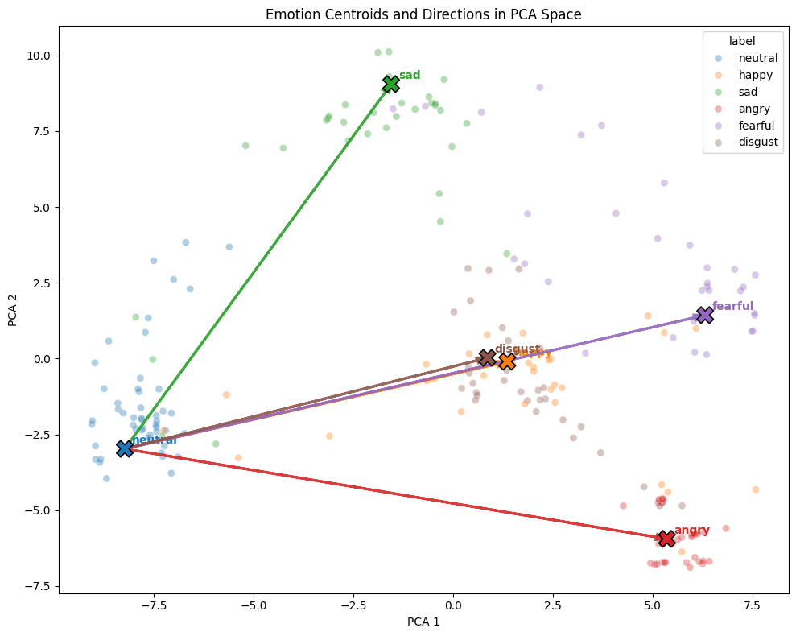

## Why This Project Exists

Most speech emotion recognition projects stop at supervised performance. They train a model, report accuracy/F1, maybe show a confusion matrix, and stop there.

This project asks a more mechanistic question:

- Does a fine-tuned speech model organize emotion as geometry in hidden-state space?
- Can we define vectors such as `angry - neutral` or `happy - neutral`?
- Do those vectors correlate with the model's output probabilities?
- If we add or remove those vectors, does the model's behavior change?
- If we patch a real hidden state from one clip into another, does emotion identity transfer?

The final answer is carefully bounded:

> The model does not feel emotion. But it carries emotion as a causal internal representation.

## Connection to Anthropic's Emotion-Vector Research

This project is inspired by Anthropic's interpretability work:

- [Anthropic research article: *Emotion concepts and their function in a large language model*](https://www.anthropic.com/research/emotion-concepts-function)
- [Transformer Circuits paper/thread: *Emotion Concepts and their Function in a Large Language Model*](https://transformer-circuits.pub/2026/emotions/index.html)
- [arXiv version](https://arxiv.org/abs/2604.07729)

Anthropic analyzed internal activations in Claude Sonnet 4.5 and found emotion-related concept vectors that activate in relevant contexts and can causally shape model behavior. Their interpretation is functional, not anthropomorphic: the existence of emotion-related internal representations does not imply subjective feeling.

This project translates that idea into speech:

| Anthropic LLM Study | This Project |
|---|---|
| Text stories/dialogues provide emotional contexts | RAVDESS speech clips provide acted emotional prosody |
| Internal emotion concept vectors in a language model | Emotion directions in wav2vec2 hidden states |
| Vector activation correlates with behavior | Direction projection correlates with emotion probabilities |
| Steering/tampering changes generated behavior | Steering, ablation, and patching change emotion predictions |
| Functional emotion is not subjective emotion | Causal emotion geometry is not felt emotion |

The speech setting gives a cleaner measurement target than open-ended generation: the model outputs a probability distribution over emotion classes. That means we can directly test whether internal emotion directions move predicted probabilities.

## Project Story in One Diagram

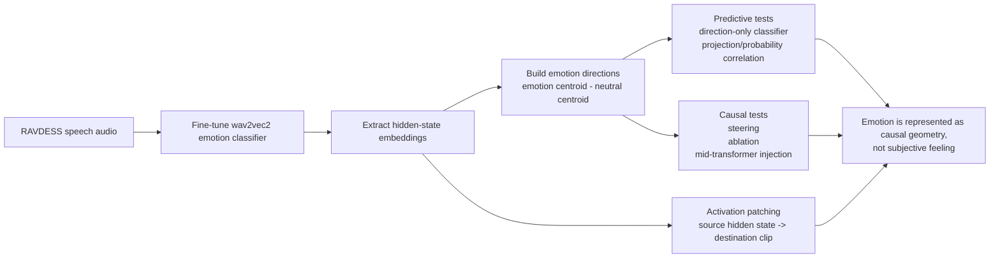

## Dataset

Dataset: **RAVDESS audio-only speech subset**

Final modeling setup:

- Original speech clips discovered: `1,440`
- Final project clips: `1,248`
- Final classes: `neutral`, `happy`, `sad`, `angry`, `fearful`, `disgust`
- Label handling: `calm` is mapped into `neutral`; `surprised` is dropped
- Split: speaker-independent
- Train actors: `01-16`
- Validation actors: `17-20`
- Test actors: `21-24`

Speaker independence is important because it prevents the model from simply memorizing actor voices. The model must generalize emotion recognition to unseen speakers.

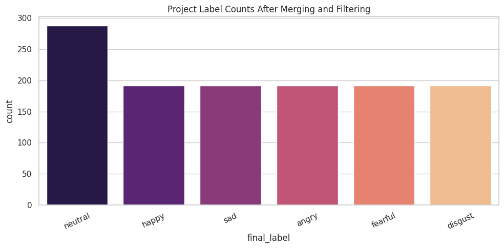

## Models

### Main Model

The main model is `facebook/wav2vec2-base`, fine-tuned for six-way speech emotion classification.

Why wav2vec2:

- It is a pretrained raw-speech encoder.
- It learns representations directly from waveform audio.
- It provides layer-wise hidden states, which makes mechanistic analysis possible.
- It substantially outperforms the CNN baseline on this task.

### Baseline Model

The baseline is a CNN trained on log-mel spectrograms. It is not intended to be state of the art; it provides a conventional acoustic-feature baseline so the wav2vec2 results have context.

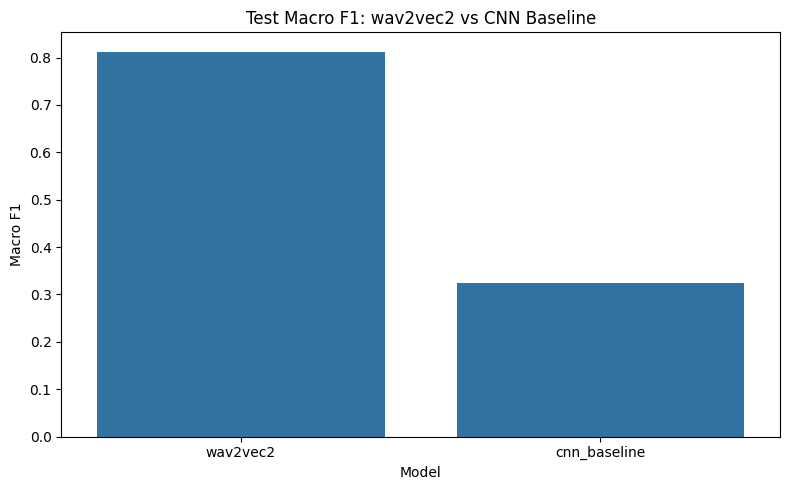

## Headline Results

| Category | Result | Interpretation |
|---|---:|---|
| wav2vec2 test accuracy / macro F1 | `0.8269 / 0.8126` | Strong speaker-independent emotion classifier |
| CNN test accuracy / macro F1 | `0.4231 / 0.3241` | Much weaker acoustic baseline |
| wav2vec2 macro-F1 gain over CNN | `+0.4885` | Justifies interpreting wav2vec2 hidden states |
| Controlled direction-only accuracy / macro F1 | `0.8413 / 0.8301` | Emotion geometry alone nearly recovers classifier behavior |
| Shuffled-label direction macro F1 | `0.0151` | Arbitrary centroid directions do not work |
| Projection/probability correlations | `r = 0.6812-0.7711` | Direction magnitude tracks model confidence |
| Same-context displacement cosine | `0.8203-0.9686` | Emotion changes move embeddings in expected directions |
| Final-layer steering delta | `+0.1921` | Adding directions raises target emotion probability |
| Full direction ablation macro-F1 delta | `-0.2889` | Removing directions damages performance |
| Random ablation control | `0.0002` macro-F1 delta | Random directions do not reproduce the damage |
| Best mid-transformer injection layer | Layer `7`, `+0.2545` target-prob delta | Emotion directions work inside the transformer, not only after it |
| Activation patching best layer | Layer `11` | Real hidden states transfer emotion identity |
| Activation patching transfer | `+0.6796` source-prob delta; `75.62%` flip rate | Strongest causal result |
| Direction-component patch | `+0.6395` delta; `72.66%` flip rate | Most patch effect is carried by the emotion-direction component |
| CREMA-D transfer macro F1 | `0.3444-0.3498` | Geometry is domain-sensitive, not universal |

## What the Core Experiments Show

### 1. Direction-Only Classification

We build emotion directions from hidden-state centroids:

```text
emotion_direction = centroid(emotion) - centroid(neutral)
```

A simple classifier using only projections onto these directions reaches:

- Test accuracy: `0.8413`
- Test macro F1: `0.8301`

This is slightly above the trained classifier head in the same embedding analysis. The important point is not that it "beats" the head, but that a tiny set of emotion directions recovers almost all supervised behavior.

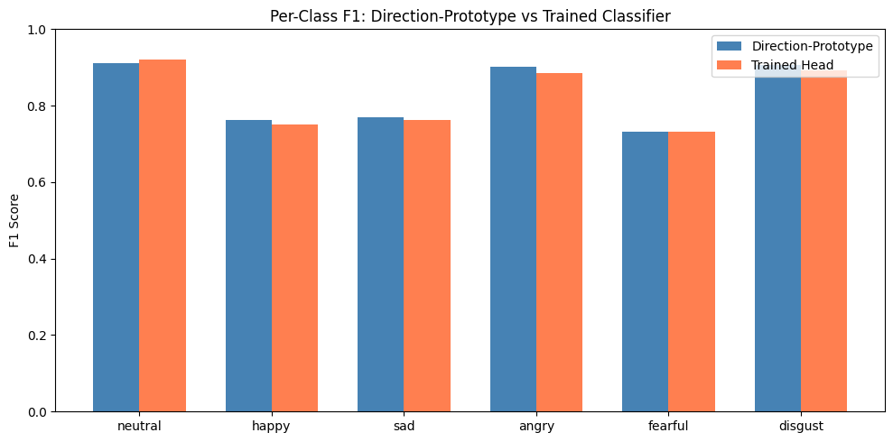

### 2. Projection Magnitude Tracks Output Probability

If a clip projects strongly onto the `angry - neutral` direction, the model should assign higher angry probability. That is what happens across held-out test clips.

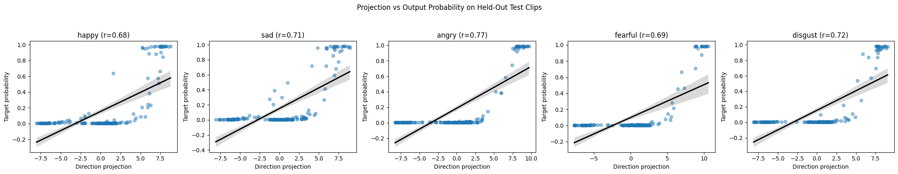

This is the first bridge from internal geometry to classifier behavior.

### 3. Steering and Ablation

Steering asks whether adding a direction changes the output:

```text
embedding' = embedding + alpha * emotion_direction
```

At `alpha = 0.5`, target emotion probability rises by `+0.1921` on average.

Ablation asks whether removing directions hurts the model:

```text
embedding' = embedding - projection_onto_emotion_directions
```

Removing all non-neutral direction components drops macro F1 by `-0.2889`.

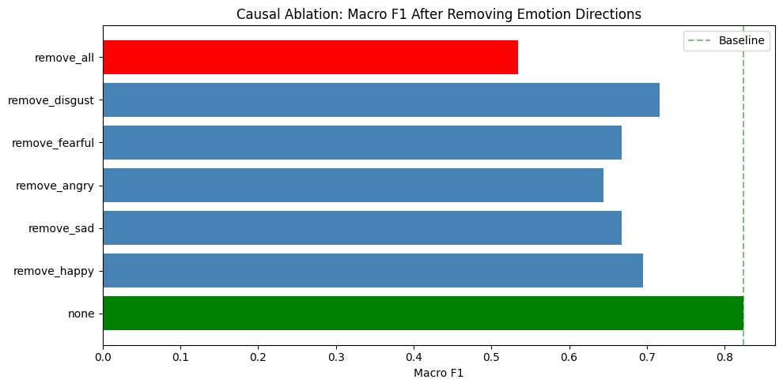

The random-direction control is crucial: norm-matched random directions do not reproduce the damage. That makes the effect emotion-specific rather than a generic vector perturbation.

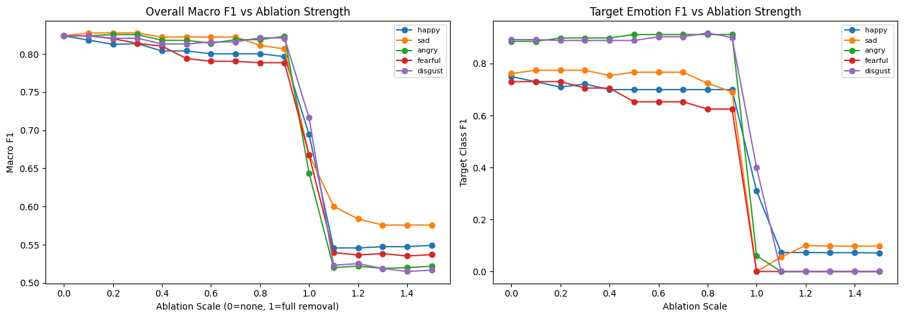

### 4. Mid-Transformer Causal Intervention

Final-layer steering could be dismissed as a post-hoc classifier-head trick. To make the test stronger, notebook `14` injects and removes emotion directions **inside wav2vec2 during the forward pass**.

The strongest sufficiency effect occurs at layer `7`:

- Mean target-probability delta: `+0.2545`
- Intervention is applied before later transformer layers finish processing

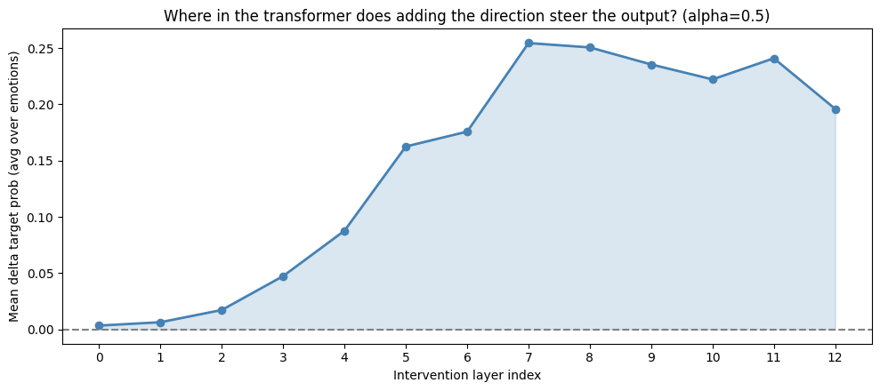

Random-vector controls again fail to reproduce the real effect.

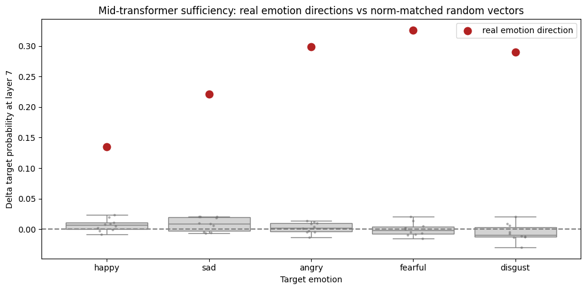

### 5. Activation Patching with Real Clips

Activation patching is the strongest causal experiment in the project.

Instead of adding a synthetic vector, we take a real hidden state from a source clip and patch it into a destination clip:

```text
source angry clip hidden state -> destination neutral clip forward pass
```

RAVDESS makes this possible because we can match:

- same actor
- same sentence
- same repetition
- same intensity
- different emotion

At layer `11`, patching transfers emotion identity:

- Same-context ordered pairs: `640`
- Mean source-emotion probability delta: `+0.6796`
- 95% CI: `[0.6475, 0.7092]`
- Prediction flips to the source emotion: `75.62%`

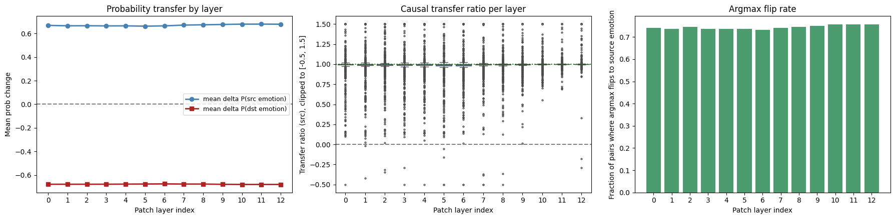

The direction-component decomposition is especially important:

| Patch Type | Mean Delta P(source) | Flip Rate |
|---|---:|---:|
| Full same-context patch | `+0.6796` | `0.7562` |
| Direction-component patch | `+0.6395` | `0.7266` |
| Orthogonal residual patch | `+0.0533` | `0.1094` |
| Self-patch control | `+0.0002` | `0.0531` |
| Random-source control | `-0.0146` | `0.0406` |

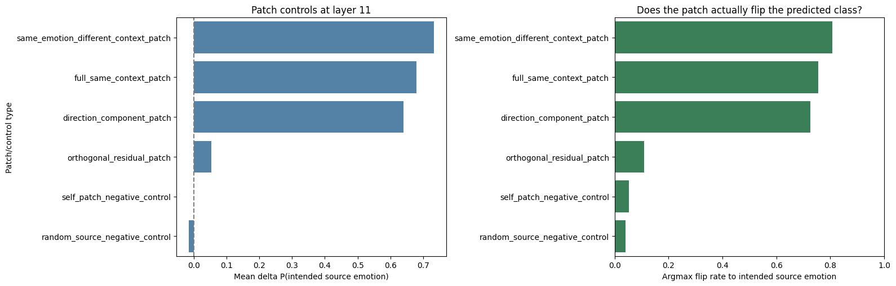

This result connects the real hidden-state patch back to the emotion-vector story: most of the transfer is carried by the emotion-direction component.

## Final Interpretation

The project's conclusion is deliberately narrow:

> No, the model does not have emotions as experiences.
>
> Yes, the model has manipulable internal representations corresponding to emotion concepts.

That distinction is the heart of the project.

The model learns to predict emotion labels, but the prediction is mediated by hidden-state geometry that can be:

- measured through projection,
- used for direction-only classification,
- correlated with output probability,
- steered by adding/subtracting vectors,
- damaged by ablation,
- changed inside the transformer,
- transferred through activation patching,
- validated against random and shuffled controls.

## Repository Structure

```text
.
├── configs/
│   ├── wav2vec.yaml
│   └── cnn_baseline.yaml
├── data/
│   └── metadata/
│       └── ravdess_metadata.csv
├── documentation/
│   ├── README.md
│   ├── research_report.md
│   ├── presentation/
│   │   └── presentation_plan.md
│   └── assets/
│       ├── figures/
│       ├── notebook_text_outputs/
│       └── tables/
├── notebooks/
│   ├── 01_eda.ipynb
│   ├── 02_wav2vec_finetuning.ipynb
│   ├── ...
│   └── 16_robustness_and_negative_controls.ipynb
├── src/
│   ├── analysis/
│   ├── data/
│   ├── models/
│   ├── training/
│   └── utils/
└── requirements.txt
```

## Notebook Reading Order

All notebooks include saved outputs and explanatory Markdown cells.

| Notebook | Purpose |
|---|---|
| `01_eda.ipynb` | Build metadata, verify labels, check actor split, inspect audio |
| `02_wav2vec_finetuning.ipynb` | Fine-tune the main wav2vec2 classifier |
| `03_emotion_vector_analysis.ipynb` | Extract embeddings and run first vector/projection/steering analyses |
| `04_final_results_summary.ipynb` | Build report-ready supervised results |
| `05_cnn_baseline_training.ipynb` | Train mel-spectrogram CNN baseline |
| `06_model_comparison.ipynb` | Compare wav2vec2 against CNN |
| `07_anthropic_style_emotion_vectors.ipynb` | Controlled directions, correlations, steering, same-context/intensity checks |
| `08_direction_only_classification.ipynb` | Direction-only prototype classifier and shuffled-label control |
| `09_causal_ablation_study.ipynb` | Remove directions and compare to random-vector controls |
| `10_emotion_arithmetic.ipynb` | Exploratory emotion blending and interpolation |
| `11_cross_dataset_transfer.ipynb` | RAVDESS-to-CREMA-D transfer boundary test |
| `12_layerwise_steering.ipynb` | Layer-wise steering analysis from cached embeddings |
| `13_sparse_autoencoder.ipynb` | Exploratory SAE analysis |
| `14_mid_transformer_causal_intervention.ipynb` | Forward-hook direction injection/removal inside wav2vec2 |
| `15_activation_patching.ipynb` | Real hidden-state patching between matched RAVDESS clips |
| `16_robustness_and_negative_controls.ipynb` | Bootstrap CIs, shuffled/random controls, per-actor sensitivity |

Recommended reading paths:

- **Fast overview:** read this README, then `documentation/research_report.md`.
- **Main results only:** notebooks `02`, `06`, `07`, `08`, `09`, `14`, `15`, `16`.
- **Full reproducibility path:** run notebooks `01` through `16` in order.
- **Presentation prep:** read `documentation/presentation/presentation_plan.md`.

## Documentation

The `documentation/` directory contains the polished project deliverables:

- `documentation/research_report.md`: detailed paper-style report.
- `documentation/presentation/presentation_plan.md`: 30-minute, 5-person presentation plan.
- `documentation/assets/figures/`: extracted notebook figures used in reports/slides.
- `documentation/assets/tables/key_results.csv`: compact table of headline metrics.
- `documentation/assets/tables/notebook_execution_status.csv`: execution/output status for each notebook.

## Setup

### 1. Clone the repository

```bash
git clone https://github.com/pavannn16/speech-emotion-directions.git
cd speech-emotion-directions
```

### 2. Create an environment

```bash
python3 -m venv .venv
source .venv/bin/activate
pip install --upgrade pip
pip install -r requirements.txt
```

### 3. Run notebooks

The notebooks are designed to run locally or in Google Colab. For expensive notebooks, Colab with a GPU is recommended.

Suggested Colab runtime:

- GPU runtime
- A100 if available
- Standard RAM is usually enough

The training and causal-intervention notebooks include Google Drive sync logic so checkpoints and expensive artifacts can be reused across sessions.

## Data and Artifact Policy

Large raw artifacts are intentionally not committed:

- `data/raw/` is ignored.
- `artifacts/` is ignored.
- model checkpoints are not stored in Git.
- raw RAVDESS audio is not stored in Git.

Persisted in Git:

- notebook code and saved outputs,
- report-ready figures,
- text outputs from executed notebooks,
- final report source,
- presentation plan,
- metric summary tables.

This keeps the repository readable and reviewable while avoiding giant model/audio files.

## Reproducibility Notes

The repo currently preserves notebook outputs. That means GitHub readers can inspect the results without rerunning the full pipeline.

Notebook execution status:

- notebooks: `16`
- stored notebook errors: `0`
- report figures extracted: `60+`
- outputs preserved in `.ipynb` files and documentation assets

If you rerun notebooks, be careful not to clear outputs before committing if you want GitHub to preserve the result cells.

## Limitations

This project is intentionally honest about its boundaries:

- **RAVDESS is acted speech.** The model may learn acted emotional prosody rather than spontaneous affect.
- **Directions are label-derived.** This is not unsupervised or true zero-shot emotion discovery.
- **Cross-dataset transfer is weak.** CREMA-D transfer results show domain sensitivity.
- **Activation patching is not a full circuit proof.** Patching hidden states can transfer more than emotion alone, although the direction-component decomposition makes the emotion-specific claim much stronger.
- **No subjective-emotion claim.** The model has functional internal representations, not felt experiences.

## Final Takeaway

This project is best summarized as:

> A fine-tuned speech emotion model does more than map audio to labels. It organizes emotion in hidden-state directions that are readable, behavior-aligned, causally steerable, necessary for performance, active inside the transformer, and transferable through real activation patches.

Or shorter:

> **Emotion in this speech model is not a feeling; it is a causal geometry in hidden state space.**
