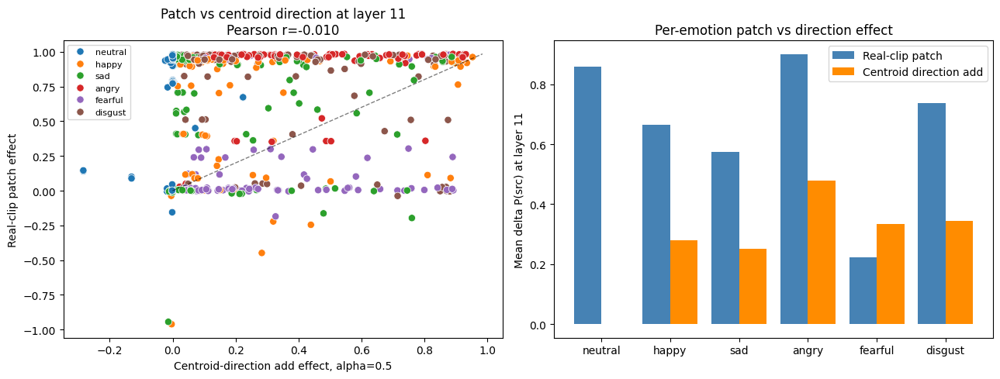
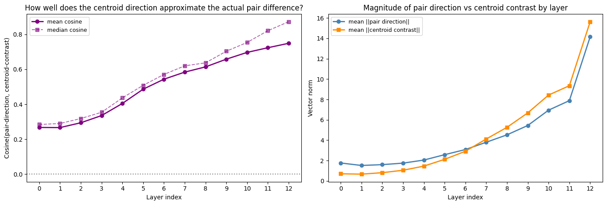

# Causal Emotion Geometry in a Fine-Tuned Speech Model

Pavan Nadendla  
Data Science Final Project  
California State University, Los Angeles

## Abstract

This project begins as a speech emotion recognition system and ends as a small mechanistic interpretability study. Inspired by Anthropic's work on emotion concept vectors in large language models, we ask whether a speech model only learns to map acoustic features to an emotion label, or whether its hidden states also contain manipulable internal emotion representations that help cause the final prediction.

We fine-tune `facebook/wav2vec2-base` on a speaker-independent six-class RAVDESS task and compare it against a mel-spectrogram CNN baseline. wav2vec2 reaches `0.8269` test accuracy and `0.8126` macro F1, compared with `0.4231` accuracy and `0.3241` macro F1 for the CNN. We then build emotion-minus-neutral directions in wav2vec2 hidden space. A direction-only prototype classifier using actor/statement-controlled directions reaches `0.8413` accuracy and `0.8301` macro F1 on held-out speakers, while shuffled-label directions collapse to `0.0151` macro F1 in the direct control.

The causal results are the core contribution. Projection onto an emotion direction correlates with the model's probability for that emotion; adding a direction raises the target probability; removing all non-neutral direction components drops macro F1 by `-0.2889` with a bootstrap 95% CI of `[-0.3395, -0.2487]`; norm-matched random directions do not reproduce this effect. Mid-transformer direction injection works inside wav2vec2 itself, with the strongest average sufficiency effect at layer `7` (`+0.2545` target probability at alpha `0.5`). Finally, same-context activation patching transfers emotion identity from source clips to destination clips: at layer `11`, source-emotion probability rises by `+0.6796` (`95% CI [0.6475, 0.7092]`) and the prediction flips to the source emotion in `75.62%` of controlled pairs.

The final claim is deliberately functional, not anthropomorphic: **the model does not feel emotion, but it carries emotion as a causal internal representation that can be measured, steered, removed, and patched to change outputs.**

## 1. Introduction

A standard speech emotion recognition project asks whether a model can classify audio into labels such as neutral, happy, sad, angry, fearful, and disgust. That is useful, but it leaves the most interesting question untouched: after the model learns the task, what kind of internal representation actually carries the answer?

The framing of this project is that a model may learn two related things at once. First, it learns predictive features that allow a classifier head to output an emotion class. Second, it may organize those features into internal concept directions or subspaces that correspond to emotion-like variables. If those internal variables are real parts of the computation, then changing them should change the model's output.

This is the bridge to Anthropic's recent work on emotion concepts in Claude Sonnet 4.5. Anthropic extracted linear emotion vectors from internal activations using labeled synthetic stories, validated that those vectors activate in appropriate emotional contexts, and showed that interventions on those vectors can affect model behavior. Their work is careful about interpretation: the existence of functional emotion representations does not imply subjective feeling. Instead, it shows that emotion concepts can be represented internally and can shape behavior.

Our project translates that idea into speech. The model is not a conversational LLM, so we cannot study generated text, preferences, or Assistant behavior. Instead, we deliberately choose a speech emotion prediction task where the output is a probability distribution over emotion classes. This gives us a cleaner measurement target: if an internal "angry minus neutral" direction is meaningful, projection onto it should correlate with angry probability, injecting it should raise angry probability, removing it should hurt angry recognition, and patching hidden states from an angry clip into another clip should transfer angry evidence.

The project therefore asks:

1. Can a fine-tuned speech model classify emotion well on held-out speakers?
2. Are its hidden states organized around emotion directions that predict the classifier output?
3. Do those directions causally affect the output when injected or removed?
4. Do real hidden states transfer emotion identity when patched across controlled clips?
5. Do negative controls show that the effect is emotion-specific rather than a generic vector perturbation?

## 2. Dataset and Task

The project uses the RAVDESS audio-only speech subset. The original speech set contains `1,440` clips. The final six-class task keeps `1,248` clips after mapping calm into neutral and dropping surprised.

| Class | Count |
|---|---:|
| neutral | 288 |
| happy | 192 |
| sad | 192 |
| angry | 192 |
| fearful | 192 |
| disgust | 192 |

The split is speaker-independent: actors `01-16` are used for training, actors `17-20` for validation, and actors `21-24` for testing. This matters because the project is not trying to memorize actor voices. The goal is to test whether emotion structure generalizes to unseen speakers.

RAVDESS is especially useful for causal analysis because clips are controlled by actor, sentence, repetition, emotion, and intensity. That lets us form same-context pairs where the actor, sentence, repetition, and intensity are fixed while only the emotion changes. Those pairs become the speech analogue of Anthropic's controlled text settings.

## 3. Models

The main model fine-tunes `facebook/wav2vec2-base`, a pretrained self-supervised raw speech encoder, with a classification head. Audio is processed at 16 kHz. The training setup uses validation macro F1 for model selection.

The comparison baseline is a CNN trained on log-mel spectrograms. The CNN is not meant to be state of the art; it is a conventional acoustic-feature baseline that tells us whether wav2vec2 learned a substantially stronger representation.

| Model | Split | Accuracy | Macro F1 | Weighted F1 |
|---|---|---:|---:|---:|
| wav2vec2 | validation | 0.7885 | 0.7762 | 0.7842 |
| wav2vec2 | test | 0.8269 | 0.8126 | 0.8210 |
| CNN baseline | validation | 0.4375 | 0.3722 | 0.3912 |
| CNN baseline | test | 0.4231 | 0.3241 | 0.3476 |


The gap is large: wav2vec2 improves test macro F1 by `+0.4885` over the CNN. This establishes the predictive foundation. The remaining experiments ask what that predictive ability is made of internally.

## 4. Anthropic-Inspired Translation

Anthropic's setup can be summarized as: extract concept vectors from activations, verify that they activate in relevant contexts, and intervene on them to test whether they influence behavior. Our speech version follows the same logic with a different model, modality, and output.

For a pooled hidden-state embedding `z_i`, we compute class centroids from training embeddings. Using neutral as the reference class, an emotion direction is:

```text
d_c = centroid(c) - centroid(neutral)
```

We also build controlled versions of these directions by centering embeddings within actor and statement groups before computing centroids. This makes the direction closer to "emotion after removing speaker/sentence confounds" rather than "emotion mixed with who spoke or what sentence was spoken."


We test these directions in an increasingly causal sequence:

| Stage | Question | Evidence Type |
|---|---|---|
| Direction-only classification | Is the geometry predictive? | Decoding from projections |
| Projection correlation | Does direction magnitude track model confidence? | Probability alignment |
| Steering | Is the direction sufficient to move outputs? | Add/subtract vector |
| Ablation | Is the direction necessary for performance? | Remove vector components |
| Mid-transformer intervention | Does the effect survive inside the network? | Forward-hook causal trace |
| Activation patching | Do real hidden states transfer emotion identity? | Source-to-destination hidden-state swap |
| Negative controls | Is this emotion-specific? | Random and shuffled baselines |

This is the main story of the project: we move from a classifier, to latent geometry, to causal intervention.

## 5. Predictive Emotion Geometry

### 5.1 Direction-Only Prototype Classification

A direction-only classifier predicts emotion using projections onto the learned emotion directions. With actor/statement-controlled directions, it reaches `0.8413` test accuracy and `0.8301` macro F1. The trained classifier head in the same embedding analysis reaches `0.8365` accuracy and `0.8237` macro F1.

| Method | Test Accuracy | Test Macro F1 |
|---|---:|---:|
| direction-only raw | 0.8365 | 0.8255 |
| direction-only controlled | 0.8413 | 0.8301 |
| direction-only shuffled labels | 0.0192 | 0.0151 |
| trained classifier head | 0.8365 | 0.8237 |


This result is important because it shows that the hidden space is not an uninterpretable cloud where only the classifier head knows the answer. A small set of emotion directions recovers essentially all of the supervised classifier's behavior. The shuffled-label control prevents a weak interpretation: arbitrary centroid directions do not work.

### 5.2 Projection Magnitude Tracks Output Probability

If a direction is truly related to an emotion concept in the model, then higher projection onto that direction should mean higher predicted probability for that emotion. That is what we observe. Across all test samples, Pearson correlations between direction projection and target probability range from `0.6812` to `0.7711`. Within true-class subsets, correlations range from `0.6701` to `0.9525`.


This is the first bridge between internal geometry and class probabilities. The direction is not just a visualization axis; its scalar coordinate is aligned with the model's probabilistic output.

### 5.3 Same-Context and Intensity Structure

Same-speaker, same-sentence, same-repetition comparisons provide an especially clean test. When only emotion changes, the embedding displacement points in the expected emotion direction. Mean cosine to the expected direction ranges from `0.8203` to `0.9686` across non-neutral emotions.

The intensity check adds a graded result. Strong-intensity clips generally project farther along the same emotion direction than normal-intensity clips. That suggests the learned geometry is not only categorical; it carries something like emotion strength.

## 6. Causal Direction Interventions

### 6.1 Steering: Adding and Subtracting Emotion Directions

Final-layer steering adds or subtracts a learned direction from the pooled embedding before classification. At alpha `0.5`, the mean target-probability increase is `+0.1921` with bootstrap 95% CI `[0.1800, 0.2043]`. Positive direction addition raises the corresponding emotion probability; negative direction addition suppresses it.

This mirrors the causal logic of Anthropic-style steering, but with a speech classifier output rather than generated text. The intervention is not "making the model feel happy." It is changing an internal representation in the happy direction and observing a predictable change in the happy class probability.

### 6.2 Ablation: Removing Emotion Directions

The complementary test removes the components of embeddings along the learned emotion directions. Removing all non-neutral direction components drops macro F1 from `0.8237` to `0.5348`, a delta of `-0.2889`. Bootstrap uncertainty from notebook `16` gives a 95% CI of `[-0.3395, -0.2487]`.


The random-direction control is decisive. Norm-matched random ablations have null mean `0.0002` and 95% interval `[0.0000, 0.0038]`, with fraction of null draws as damaging as the real ablation equal to `0.0`. The ablation-strength sweep adds a dose-response view of the same necessity claim.


So the effect is not simply "removing any vector hurts." Removing these specific emotion directions hurts.

## 7. Mid-Transformer Causal Trace

Final embedding interventions are useful, but they happen after most of the network has already computed. Notebook `14` upgrades the test by injecting and removing emotion directions inside wav2vec2 during the forward pass.

At each layer, we compute layer-specific directions. For sufficiency, we add a target direction into the hidden state at every valid time step and allow the remaining transformer layers to propagate naturally. The strongest average sufficiency effect occurs at layer `7`, where alpha `0.5` increases target probability by `+0.2545`.


A norm-matched random-vector injection control shows that this is not caused by generic hidden-state perturbation. For all target emotions, the fraction of random vectors matching or exceeding the real direction effect is `0.0`.


For necessity, direction removal inside the model is most damaging at layer `8`, with average macro-F1 delta `-0.1513`. This is a stronger claim than "the final embedding contains separable clusters." It shows that emotion directions can be perturbed inside the model and still change the downstream output after the remaining layers run.

## 8. Activation Patching with Real Clips

Activation patching is the cleanest causal experiment in the project. Instead of adding a synthetic centroid direction, we patch a real hidden state from one clip into another. RAVDESS makes this possible because we can pair clips that share actor, sentence, repetition, and intensity but differ in emotion.

For an ordered source-destination pair, the destination hidden state at a selected layer is replaced with the source hidden state, and the rest of the model runs normally. If the destination prediction moves toward the source emotion, then the patched hidden state causally carries emotion identity.

The experiment evaluates `640` same-context ordered pairs at normal intensity. At layer `11`, source-emotion probability increases by `+0.6796` on average with 95% CI `[0.6475, 0.7092]`; the argmax flips to the source emotion in `75.62%` of pairs with CI `[72.19%, 78.91%]`.


### 8.1 Direction Component vs Residual Component

Notebook `15` then decomposes the patch into a direction component and an orthogonal residual. This is the experiment that makes the story feel especially research-grade.

| Patch Intervention | Mean Delta P(source) | Flip Rate |
|---|---:|---:|
| same-emotion different-context patch | +0.7328 | 0.8078 |
| full same-context patch | +0.6796 | 0.7562 |
| direction-component patch | +0.6395 | 0.7266 |
| orthogonal residual patch | +0.0533 | 0.1094 |
| self-patch negative control | +0.0002 | 0.0531 |
| random-source negative control | -0.0146 | 0.0406 |


This supports a very clean conclusion: the full hidden state transfers emotion strongly, and most of that transfer is carried by the emotion-direction component. The orthogonal residual is much weaker, while self-patch and random-source controls fail.

### 8.2 Centroid Directions Are Powerful but Incomplete

The project also avoids overclaiming. The pairwise patch effect and the synthetic centroid-direction steering effect are not strongly correlated at the individual pair level: Pearson `r = -0.0096`, Spearman `r = -0.0629`.



This does not break the story. It refines it. The model's internal emotion representation is not a single magic vector. Population directions are excellent probes and causal handles, but real examples contain richer high-dimensional structure: timing, speaker prosody, intensity, and pair-specific acoustic details. Pair-specific displacements become increasingly aligned with centroid contrasts in late layers, peaking at mean cosine `0.7490` in layer `12`.



## 9. Robustness and Negative Controls

Notebook `16` consolidates the statistical confidence story. The main findings survive bootstrap uncertainty, actor sensitivity checks, and null controls.

| Quantity | Point | 95% CI |
|---|---:|---:|
| trained head accuracy | 0.8365 | [0.7885, 0.8846] |
| trained head macro F1 | 0.8237 | [0.7688, 0.8762] |
| controlled direction classifier accuracy | 0.8413 | [0.7885, 0.8894] |
| controlled direction classifier macro F1 | 0.8301 | [0.7703, 0.8796] |
| direction ablation macro-F1 delta | -0.2889 | [-0.3395, -0.2487] |
| final-layer steering delta | +0.1921 | [0.1800, 0.2043] |
| activation patch delta | +0.6796 | [0.6475, 0.7092] |
| activation patch flip rate | 0.7562 | [0.7219, 0.7891] |

The per-test-actor analysis also matters. Actors `21-24` each have `52` test clips. Direction macro F1 ranges from `0.7677` to `0.8771`, and ablation is damaging for every actor. This reduces the risk that one held-out actor is driving the result.

## 10. Auxiliary Results and Boundaries

Cross-dataset transfer to CREMA-D is weak: trained-head macro F1 is `0.3498`, centroid macro F1 is `0.3473`, and direction-only macro F1 is `0.3444`. This is an important boundary. The discovered geometry is strong for held-out RAVDESS speakers, but it is not a universal speech-emotion representation across datasets.

The sparse autoencoder experiment is exploratory. It reconstructs embeddings with normalized MSE `0.1363`, mean cosine `0.9390`, and preserves classifier behavior almost exactly (`0.8237` macro F1 to `0.8222`). That suggests classifier-relevant information survives the SAE bottleneck, but the project should not overclaim monosemantic emotion units.

Emotion arithmetic and layerwise steering are also useful exploratory appendices. They make the geometry more intuitive, but the central evidence remains the controlled direction classifier, projection/probability alignment, ablation, mid-transformer intervention, patching, and negative controls.

## 11. Discussion: What the Results Mean

The project now has a coherent causal chain.

First, wav2vec2 learns speaker-independent emotion recognition much better than a conventional CNN baseline. Second, the final hidden space organizes emotion in directions that recover the classifier output. Third, the magnitude of projection onto those directions tracks the model's class probabilities. Fourth, adding or subtracting directions moves probabilities in the expected direction. Fifth, removing direction components damages performance, while norm-matched random directions do not. Sixth, injecting directions inside the transformer changes outputs after the remaining layers run. Seventh, real hidden-state patching transfers emotion identity between controlled clips, and the direction-component patch carries most of that transfer.

That is the Anthropic-inspired bridge. Anthropic studied emotion concepts in an LLM and showed that internal vectors could shape generated behavior. We study a speech classifier and show that internal emotion directions shape class probabilities. The output type is different, but the mechanistic structure is parallel:

| Anthropic LLM Study | This Project |
|---|---|
| Text stories/dialogues provide labeled emotion contexts | RAVDESS speech clips provide labeled emotion prosody |
| Residual stream vectors represent emotion concepts | wav2vec2 hidden directions represent speech emotion concepts |
| Vector activations correlate with relevant behavior | Direction projections correlate with emotion probabilities |
| Steering/tampering changes model behavior | Steering, ablation, and patching change emotion predictions |
| Functional emotion is not subjective emotion | Causal emotion representation is not felt emotion |

### How to Read the Evidence

The most important distinction is between *decodability* and *causal use*. A representation is decodable if a probe or classifier can read information from it, but decodability alone does not prove the model relies on that information. Here, the direction-only classifier establishes decodability, while ablation, steering, mid-transformer intervention, and activation patching test causal use. When removing the direction hurts classification and adding the direction shifts probabilities, the representation is no longer merely readable; it is functionally connected to the output.

The negative controls make this causal claim more specific. Shuffled-label directions fail as classifiers, norm-matched random directions do not reproduce the ablation damage, and random-vector injections do not match real emotion-direction steering. The activation patching result then provides the closest speech analogue to Anthropic's behavioral intervention story: a real hidden state from one controlled clip transfers emotion evidence into another, and the direction-component patch carries most of that transfer. This is why the final conclusion is about a causal geometry rather than a single isolated vector.

### Do Models Have Emotions?

This project should not claim that the model has emotions in the human, subjective, or conscious sense. A speech classifier does not feel anger when the angry probability increases. An LLM does not automatically have subjective fear because a fear vector activates.

The scientifically defensible claim is narrower and stronger: models can learn internal emotion-like variables that are functionally connected to behavior. In our case, the behavior is a predicted emotion distribution. The model's output is not only produced by a black-box classifier head; it is mediated by hidden-state geometry that can be probed and causally manipulated.

So the answer is:

```text
No, the model does not have emotions as experiences.
Yes, the model has manipulable internal representations corresponding to emotion concepts.
```

That distinction is the heart of the report.

## 12. Limitations

RAVDESS is acted speech, not spontaneous affect. The results are about a model trained to classify acted emotional prosody. The speaker-independent split makes the evaluation stronger, but the dataset is still small and controlled.

The directions are estimated from labeled training data, so the direction-only classifier is not external zero-shot recognition. It is better described as a direction-only prototype classifier.

The cross-dataset result is weak, so the learned geometry should be framed as robust inside the RAVDESS-style domain rather than universal across all emotional speech.

Activation patching replaces hidden-state sequences and can transfer more than emotion alone. The direction-component decomposition addresses this concern, but a deeper circuit-level project would need time-localized patching, path patching, and stronger disentanglement of prosody, speaker, and lexical content.

Finally, the project uses population centroid directions. These are useful and causal, but the low pairwise patch-vs-centroid correlation shows that individual examples contain richer structure than a single averaged vector.

## 13. Conclusion

The final project is complete as a data science and interpretability story. It starts with a standard SER model, but the strongest contribution is not simply classification accuracy. The stronger contribution is that emotion prediction in the model is linked to internal directions that are predictive, probabilistically aligned, causally steerable, necessary for performance, active inside the transformer, transferable through real activation patches, and robust against random/shuffled controls.

The tagline is:

> Emotion in this speech model is not a feeling; it is a causal geometry in hidden state space.

That is the careful bridge between Anthropic's emotion-vector research and our RAVDESS wav2vec2 implementation. The model learns to predict emotion classes, but the prediction is mediated by internal emotion representations that can be experimentally tampered with to change the output.

All report figures are extracted from executed notebook outputs, so the final narrative stays traceable to reproducible project artifacts rather than manually recreated plots.

## References

Baevski, A., Zhou, Y., Mohamed, A., & Auli, M. (2020). wav2vec 2.0: A framework for self-supervised learning of speech representations.

Cao, H., Cooper, D. G., Keutmann, M. K., Gur, R. C., Nenkova, A., & Verma, R. (2014). CREMA-D: Crowd-sourced emotional multimodal actors dataset. IEEE Transactions on Affective Computing.

Khalil, R. A., Jones, E., Babar, M. I., Jan, T., Zafar, M. H., & Alhussain, T. (2019). Speech emotion recognition using deep learning techniques: A review. IEEE Access.

Lieskovska, E., Jakubec, M., Jarina, R., & Chmulik, M. (2021). A review on speech emotion recognition using deep learning and attention mechanism. Electronics.

Livingstone, S. R., & Russo, F. A. (2018). The Ryerson Audio-Visual Database of Emotional Speech and Song (RAVDESS).

Schuller, B., Steidl, S., & Batliner, A. (2009). The INTERSPEECH 2009 Emotion Challenge. Proceedings of INTERSPEECH 2009.

Sofroniew, N., Kauvar, I., Saunders, W., Chen, R., Henighan, T., Hydrie, S., Citro, C., Pearce, A., Tarng, J., Gurnee, W., Batson, J., Zimmerman, S., Rivoire, K., Fish, K., Olah, C., & Lindsey, J. (2026). Emotion Concepts and their Function in a Large Language Model. Anthropic Transformer Circuits Thread.

Vaswani, A., Shazeer, N., Parmar, N., Uszkoreit, J., Jones, L., Gomez, A. N., Kaiser, L., & Polosukhin, I. (2017). Attention is all you need. Advances in Neural Information Processing Systems.

## Appendix A. Notebook Execution Status

Every notebook from `01` through `16` has saved outputs and zero stored errors.

| Notebook | Role |
|---|---|
| `01_eda.ipynb` | Dataset construction, split verification, EDA |
| `02_wav2vec_finetuning.ipynb` | wav2vec2 fine-tuning |
| `03_emotion_vector_analysis.ipynb` | embedding extraction, layerwise centroids, initial steering |
| `04_final_results_summary.ipynb` | final supervised results and confusion matrix |
| `05_cnn_baseline_training.ipynb` | CNN baseline training |
| `06_model_comparison.ipynb` | wav2vec2 vs CNN comparison |
| `07_anthropic_style_emotion_vectors.ipynb` | controlled vectors, correlations, bidirectional steering, same-context and intensity analyses |
| `08_direction_only_classification.ipynb` | direction-only prototype classifier and shuffled-label control |
| `09_causal_ablation_study.ipynb` | direction removal, ablation strength sweep, random-direction control |
| `10_emotion_arithmetic.ipynb` | latent emotion arithmetic and blending |
| `11_cross_dataset_transfer.ipynb` | RAVDESS-to-CREMA-D transfer |
| `12_layerwise_steering.ipynb` | layer-source steering analysis |
| `13_sparse_autoencoder.ipynb` | exploratory SAE analysis |
| `14_mid_transformer_causal_intervention.ipynb` | true mid-transformer direction injection, ablation, and random-vector controls |
| `15_activation_patching.ipynb` | real-clip activation patching, patch controls, and direction-component decomposition |
| `16_robustness_and_negative_controls.ipynb` | bootstrap CIs, shuffled/random controls, per-test-actor sensitivity |

## Appendix B. Persisted Result Assets

The report uses figures extracted from executed notebooks and stored under `documentation/assets/figures/`. The Overleaf-ready LaTeX source lives under `documentation/finalprojectDSlatexsource/` with all referenced figures copied into `documentation/finalprojectDSlatexsource/figures/`.
